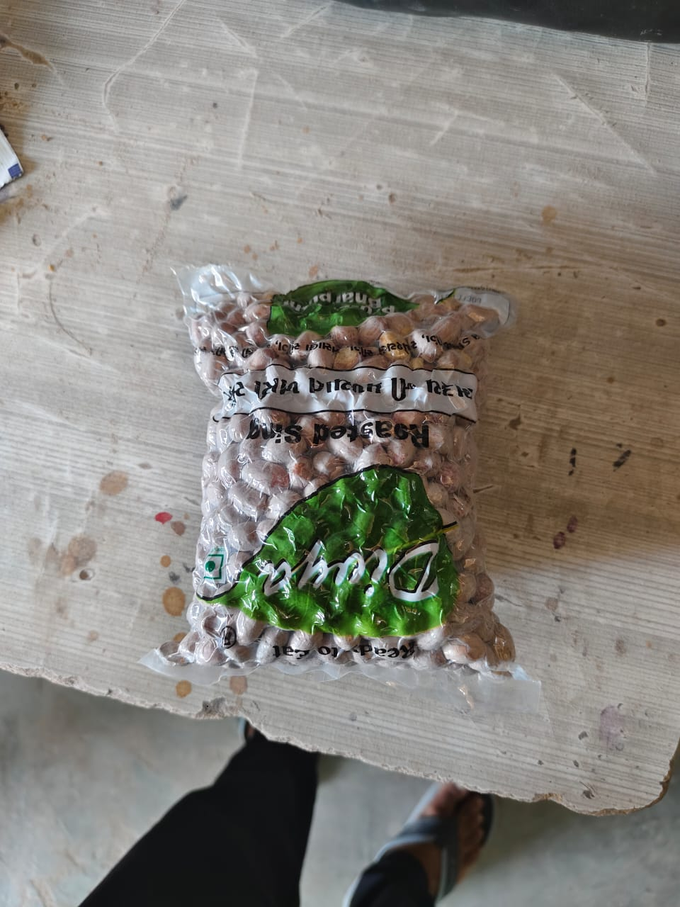

<!DOCTYPE html>
<html>

<head>

<title>Nutri Roast | Premium Peanuts</title>

</head>

<body>

<nav>

🥜 Nutri Roast

<a href="#">Home</a>

<a href="#">Shop</a>

<a href="#">Products</a>

<a href="#">Contact</a>

</nav>

<section class="hero">

<h1>

Real Taste Of

Roasted Peanuts

</h1>

Fresh crispy roasted peanuts.
Premium quality snacks with natural taste and fast delivery.

<button>

Order Now 🛒

</button>

</section>

🥜

🥜

🥜

<section class="features">

<h2>🌱</h2>

<h3>100% Natural</h3>

No Chemicals

<h2>🔥</h2>

<h3>Fresh Roast</h3>

Daily Fresh

<h2>🚚</h2>

<h3>Fast Delivery</h3>

Safe Packing

</section>

</body>

</html>

</section>

</body>
<!-- SEARCH -->

  

    <input id="mySearch" type="text" placeholder="product, brand">

    <button class="search-btn" onclick="searchNow()">
      🔍 Search
    </button>

  

<header>
    <h1>🛒 Mera Online Store</h1>
    
Best Quality Products | Fast Delivery

</header>

    <!-- PRODUCT 1 -->
    

        
        

            <h2>ROASTED SING</h2>
            
₹150

            <a class="btn buy" href="upi://pay?pa=yourupi@upi&am=150&cu=INR">💳 Pay Now</a>

            <a class="btn whatsapp" href="https://wa.me/919601393176?text=I%20want%20to%20buy%20Roasted%20Sing">
            📲 Order
            </a>
        

    

    <!-- PRODUCT 2 -->
    

        
        

            <h2>BANASKATHA SING</h2>
            
₹120

            <a class="btn buy" href="upi://pay?pa=yourupi@upi&am=120&cu=INR">💳 Pay Now</a>

            <a class="btn whatsapp" href="https://wa.me/919601393176?text=I%20want%20to%20buy%20Banaskantha%20Sing">
            📲 Order
            </a>
        

    

    <!-- PRODUCT 3 -->
    

        
        

            <h2>PRODUCT 3</h2>
            
₹180

            <a class="btn buy" href="upi://pay?pa=yourupi@upi&am=180&cu=INR">💳 Pay Now</a>

            <a class="btn whatsapp" href="https://wa.me/919601393176?text=I%20want%20Product%203">
            📲 Order
            </a>
        

    

    <!-- PRODUCT 4 -->
    

        
        

            <h2>PRODUCT 4</h2>
            
₹200

            <a class="btn buy" href="upi://pay?pa=yourupi@upi&am=200&cu=INR">💳 Pay Now</a>

            <a class="btn whatsapp" href="https://wa.me/919601393176?text=I%20want%20Product%204">
            📲 Order
            </a>
        

    

</body>

</script>
</html>
</html>

